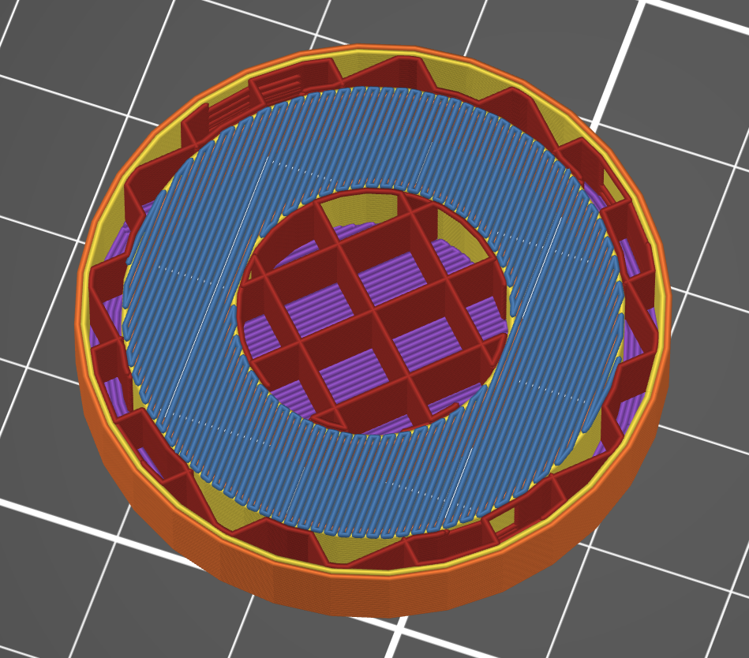
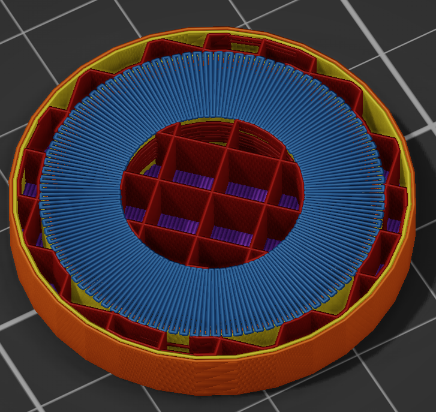

# Radial bridges — a PrusaSlicer slicing plugin

A `slicing.fill_planner` plugin for PrusaSlicer 3.x. It lays a bridge over an annular gap
out as spokes running from the inner island to the surrounding wall, instead of parallel
lines running across the whole opening.

## The problem

The stock fill patterns run straight lines in a single direction chosen per surface. Over
a ring-shaped gap — a boss inside a wall, a hub inside a rim — that direction is wrong for
most of the area. The lines that pass closest to the inner island become long chords
spanning the entire opening, while the gap they actually have to cross is only as wide as
the ring.

On the test model, a 20 mm boss inside a 32 mm bore, the widest gap to cross is 6 mm but
the longest bridge line is **27.7 mm**.



Every line runs the same way regardless of where the anchors are. The ones passing closest
to the hub are the longest in the layer, and they are unsupported over most of their
length; the ones out at the sides are short only by accident of the geometry.

## What this does

Spokes. Every line runs outwards from the inner island to the outer wall, so no line is
longer than the gap it crosses, whatever the diameters are.

Two things make it practical rather than merely geometric:

- **The spoke count is matched to the middle radius.** Spokes fan out as they go, so
  matching the line spacing at the inner edge leaves the outer edge sparse, and matching
  it at the outer edge crowds the inner one. Matching it half way puts the average where
  it belongs, and the material laid down comes out within a few percent of the pattern it
  replaces.
- **The spokes are walked as one continuous path**, out along one and back along the next.
  Emitted as separate lines they cost 2.6 m of extra travel on one layer; joined up they
  cost none.



The hairpin turns at both edges are the continuous path: the head runs out along one spoke,
turns on the anchor, and comes back along the next. The spokes are visibly tighter at the
inner edge than the outer one, which is the fan spreading as it goes; the count is chosen so
that the average lands on the line spacing.

The plugin claims only a surface it can improve: a bridge whose region has a hole in it.
Everything else is declined and the slicer fills it exactly as before.

## Measurements

`radial_bridge.stl`, Prusa CORE One 0.4 HF, 0.20 mm SPEED, layer 31 — the layer that
closes the ring.

| | stock | radial |
|---|---|---|
| longest bridge line | 27.69 mm | **7.69 mm** |
| bridge line laid | 1 519.4 mm | 1 613.7 mm |
| travel on that layer | 137.6 mm | **130.4 mm** |
| travel moves on that layer | 17 | 17 |

The longest unsupported run drops by 3.6×, for 6 % more material and slightly *less*
travel than the stock pattern.

Two intermediate designs are worth recording as the reasons for the final one: separate
spokes matched to the inner radius gave the same 7.7 mm lines but 2 593 mm of travel and
29 % less material, and adding spokes by doubling the count where they spread too far
gave 5 137 mm of travel and 42 % *more* material than stock.

On a model with no annular bridge — a garage with ordinary walls — travel and extrusion
come out identical to a slice with the plugin removed.

## Settings

**There is no user interface for this — the file is the interface.** PrusaSlicer's
_Plugins_ menu, and the parameter dialog behind it, only ever list plugins of type
`project.plugin`, the ones you invoke yourself. A slicing plugin is not invoked; it hooks
into the slicing itself, so it never appears there and has nothing to click. Everything it
can be told is in `settings.lua`.

The file lives inside the plugin's bundle directory, next to the plugin's own `.lua`:

```
~/.config/PrusaSlicer3-dev/lua/com.github.dzwiedziu-nkg.radial-bridge/settings.lua
```

If you installed the plugin by symlinking your checkout — which is the sane way — that
path is the symlink and editing the file in the checkout is the same thing.

It is a Lua file that returns one table, so an entry is `key = value,` with the comma, and
`--` starts a comment. Strings take quotes, booleans are `true` / `false`, and a value in
`{ }` is a table of its own. Comment a line out and the plugin's built-in default applies:

```lua
return {
    flow_ratio = 0.9,   -- the rest keep their defaults
}
```

**Save it and slice again — that is all.** No restart, no _Rescan_: the plugin directories
are read afresh for every slice.

One warning about how it fails. The plugin loads the file inside a `pcall`, so a **syntax
error is not reported anywhere** — the file is simply ignored and every default applies. If
a change of yours seems to do nothing at all, that is the first thing to suspect: a missing
comma, a missing brace, a stray quote.

The keys, in full:

| key | default | meaning |
|---|---|---|
| `filtered_roles` | `BridgeInfill` | Roles the planner may take over. |
| `min_hole_radius` | `1.0` | Skip surfaces whose hole is smaller than this, in mm. |
| `density` | `1.0` | How many spokes, as a multiple of the matched count. |
| `flow_ratio` | `1.0` | Multiplies the extrusion of the spokes. |
| `match_stock_material` | `false` | Scale the flow to the volume the stock pattern would have laid. |
| `max_spokes` | `2000` | Refuse a surface needing more spokes than this. |

In full, which is the whole file:

```lua
return {
    -- The allowlist of roles the planner may take over. Bridges only by default:
    -- this pattern is about unsupported spans, and an ordinary solid layer has
    -- nothing to gain from it.
    filtered_roles = {BridgeInfill = true},
    min_hole_radius = 1.0,
    density = 1.0,
    flow_ratio = 1.0,
    match_stock_material = false,
    max_spokes = 2000,
}
```

`flow_ratio` and `density` are the two you will actually reach for, and the section below
says which one for which symptom. `min_hole_radius` and `max_spokes` are guards: they stop
the plugin claiming a surface where the fan would come out worse than the pattern it
replaces, and are worth leaving alone.

**`density` changed meaning in 0.2.0.** It used to multiply the *spacing*, so a bigger
number meant fewer spokes — the opposite of what the word says and of what `fill_density`
does in the slicer. It now multiplies the spoke count. At the default of 1.0 the two are
the same; any other value you had set means the other thing now.

### When a strand curls up

A fan is not evenly spaced. The spokes are chosen to average the slicer's line spacing
half way out, which leaves them **tighter than nominal at the inner edge** by the ratio of
the two radii — on the test model, 6 mm of ring around a 10 mm hub, about 20 % tighter.
Too much plastic in too little space is what lifts a bridge strand off its neighbours and
into the path of the nozzle, and the inner edge is where it shows first.

`flow_ratio` is the knob for that, and it is the right one: 0.85 to 0.95 thins each strand
where it stands. `density` moves the strands apart instead, which trades the crowding at
the inner edge for wider gaps at the outer one. Reach for `flow_ratio` first.

`match_stock_material` computes the correction rather than guessing it. The plugin knows
how much line it is about to lay, and how much the parallel pattern would have laid over
the same area at the same spacing, and scales the flow by the ratio of the two. It is off
by default because it thins the outer edge too, and the outer edge is already the sparse
one.

Measured on the test model's layer 31, in filament laid on that layer:

| | filament | line laid | vs stock |
|---|---|---|---|
| stock | 51.94 mm | 1 519.4 mm | |
| plugin, defaults | 55.15 mm | 1 613.7 mm | +6.2 % |
| `flow_ratio = 0.90` | 49.63 mm | 1 613.7 mm | −4.4 % |
| `match_stock_material` | 52.53 mm | 1 613.7 mm | **+1.1 %** |
| `density = 1.20` | 65.64 mm | 1 920.7 mm | +26.4 % |

`flow_ratio` scales the filament exactly — 0.90 and 0.50 come out at 0.9000 and 0.5000 of
the default — because it is applied to the flow the slicer computed, not to the geometry.
`density` scales the line laid instead, and the filament follows it. The longest
unsupported line stays 7.69 mm in all of them; none of these knobs touches what the pattern
is for.

## Requirements

**This plugin does not work with an official PrusaSlicer release.** The `slicing.fill_planner` API does
not exist in PrusaSlicer 3.x as shipped; it is added by a fork:

- the fork, branch `main`, which carries all five hooks: https://github.com/dzwiedziu-nkg/PrusaSlicer
- how to build and run it: https://github.com/dzwiedziu-nkg/PrusaSlicer/blob/main/doc/Build_plugin_fork.md
- the API contract: `doc/Plugin_API.md` in those sources

Prusa have said they intend to expose the slicing pipeline to plugins themselves. When they
do, this plugin should be rewritten against their interface and the fork dropped.

## Installing

```bash
ln -s "$PWD/com.github.dzwiedziu-nkg.radial-bridge" ~/.config/PrusaSlicer/lua/
```

The directory name has to match the `id` in `manifest.json`. The plugin has no menu entry.
The log names it at the start of every slice and reports what it took over at the end:

```
[info] Fill planner plugin in use: com.github.dzwiedziu-nkg.radial-bridge.radial_bridge
[info] Fill planner plugin ... laid out 1 of 77 surfaces
```

## Limitations

- The spokes radiate from the centroid of the largest hole. A surface whose hole is far
  from round, or which has several holes of similar size, will not come out as a tidy fan.
- Spacing is uniform in angle, not in area: it is tighter than nominal at the inner edge
  and looser at the outer one, by the ratio of the two radii. On a very wide ring that
  difference becomes visible.
- It does not consider where the anchors actually are; it assumes the ring is anchored on
  both edges, which is what makes a bridge over an annular gap a good case for it and a
  bridge over a slot a poor one.
- The slicer calls this hook from its parallel infill stage, and the Lua state behind it
  is single threaded, so a plugin claiming every surface of a large print would serialize
  that stage. This one claims very few.

## License

AGPL-3.0-only, the same licence as PrusaSlicer itself. The full text is in `LICENSE`.
